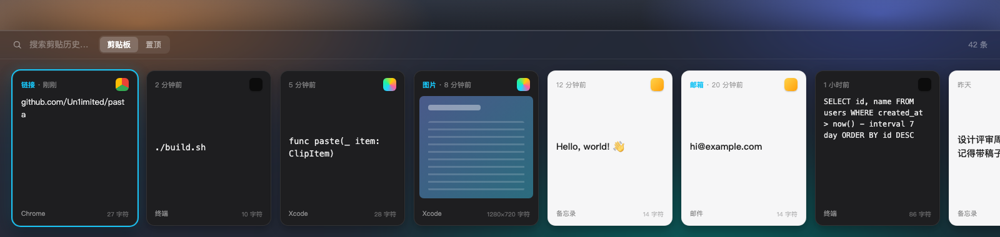

<div align="center">

# Pasta

**贴在屏幕底部的 macOS 剪贴板历史管理器**
A bottom-docked clipboard history manager for macOS — local, fast, keyboard-first.




</div>

按 `⇧⌘V`，剪贴历史从屏幕底部弹出——横向卡片、深色磨砂、键盘全导航。纯本地、无网络、无账号。原生 AppKit，只用 Swift + 命令行工具构建，不需要完整 Xcode。

## ✨ 功能

- 🗂 **自动记录**剪贴板历史：文本 / 图片 / 文件，去重、最近优先、本地持久化
- 🎨 **卡片跟随来源深浅**：从终端 / 编辑器复制 → 深色卡，从浏览器 / 聊天复制 → 白色卡
- 🏷 卡片带**来源 App 图标 + 名称**、相对时间、字符数；图片显示缩略图
- ⌨️ **键盘全导航**：`←→` 选卡片，`↑↓` 在搜索框 / 标签 / 卡片间切换，`⏎` 粘贴
- 🔍 模糊搜索 + `剪贴板 / 置顶` 标签切换
- 📌 一键置顶（`⌘P`）、删除（`⌘⌫`）；hover 高光、点击 / 双击粘贴
- 📋 选中后**自动切回原 App 并粘贴**
- 🧹 **纯文本粘贴**（去格式，`⌥⏎` 或全局开关）+ **历史过期清理**（永不 / 1 / 7 / 30 天）
- ⚙️ 菜单栏图标、自定义热键、开机自启
- 🔒 跳过密码管理器标记的敏感内容

## 📦 安装

### 方式一 · 从源码构建（推荐，零 Gatekeeper 摩擦）

需要 macOS 命令行工具（`xcode-select --install`）。本地构建出来的 App 不会被 Gatekeeper 拦。

```bash
git clone https://github.com/Un1imited/pasta.git
cd pasta
./build.sh        # 编译并打包成 Pasta.app
open Pasta.app    # 运行，菜单栏出现剪贴板图标（无 Dock 图标）
```

把 `Pasta.app` 拖到 `/Applications` 即可常驻。

### 方式二 · 下载预编译版

从 [Releases](https://github.com/Un1imited/pasta/releases) 下载 `Pasta-x.y.z.zip`，解压拖到 `/Applications`。

> 预编译版是 **Apple Silicon（arm64）**；Intel Mac 请走方式一。
>
> 本项目**未做 Apple 公证**，下载版首次打开会被 Gatekeeper 拦。放行：**右键 `Pasta.app` → 打开**（点一次即可），或 `xattr -dr com.apple.quarantine /Applications/Pasta.app`。

### 首次使用：授予「辅助功能」权限

模拟 `⌘V` 粘贴需要辅助功能权限：**系统设置 → 隐私与安全性 → 辅助功能** → 勾选 **Pasta**，然后**重启 App**。未授权时历史 / 搜索 / 复制都正常，只是自动粘贴不生效（可自行 `⌘V`）。

## ⌨️ 快捷键

| 操作 | 按键 |
|------|------|
| 唤出 / 收起卡片栏 | `⇧⌘V` |
| 卡片间选择 | `←` `→` |
| 搜索框 / 标签 / 卡片切换焦点 | `↑` `↓` |
| 切换 剪贴板 / 置顶 | `⌘1` / `⌘2` |
| 粘贴选中项 | `⏎`（或双击） |
| 纯文本粘贴 | `⌥⏎` |
| 置顶 / 取消 | `⌘P` |
| 删除 | `⌘⌫` |
| 关闭 | `esc` |
| 搜索 | 直接输入 |

唤起快捷键、纯文本默认、历史保留时长都可在 **菜单栏 → 偏好设置（`⌘,`）** 里改。

## 🗃 数据位置

```
~/Library/Application Support/Pasta/history.json
```

纯本地，从不上传。删除该文件即清空历史。

## 🛠 开发

```bash
swift run            # 直接跑
./build.sh           # 打包 Pasta.app（自签名 / ad-hoc，自动带图标）
./release.sh 1.0.0   # 打包成 dist/Pasta-1.0.0.zip（发布用）
```

源码在 `Sources/Pasta/`：AppKit 菜单栏 App，剪贴板轮询、Carbon 全局热键、CGEvent 模拟粘贴、底部卡片栏面板。图标源在 `_design/icon-final.html`。

## License

[MIT](LICENSE)
