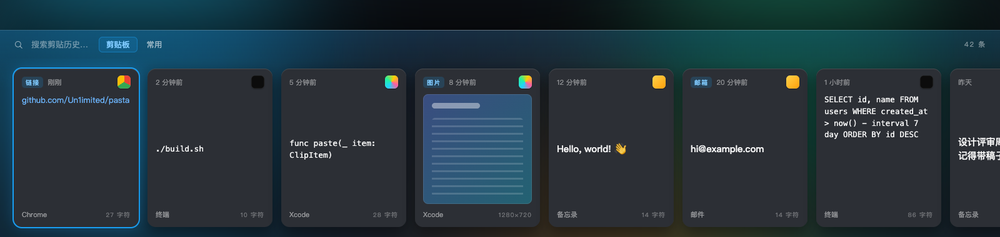

<div align="center">

# Pasta

**贴在屏幕底部的 macOS 剪贴板历史管理器**
A bottom-docked clipboard history manager for macOS — local, fast, keyboard-first.




</div>

按 `⇧⌘V`，剪贴历史从屏幕底部弹出——横向卡片、深色磨砂、键盘全导航。纯本地、无账号；除手动点击「检查更新」外不发任何网络请求。原生 AppKit，只用 Swift + 命令行工具构建，不需要完整 Xcode。

> 🌏 Pasta 为中文用户设计，界面为简体中文（UI is Simplified Chinese by design）。

## ✨ 功能

- 🗂 **自动记录**剪贴板历史：文本 / 图片 / 文件，去重、最近优先、本地持久化
- 🎨 **四套主题皮肤**（午夜青 / 晨光 / 纯墨 / 晶蓝玻璃拟态），全部通过 WCAG AA 对比度
- 🏷 卡片带**来源 App 图标 + 名称**、相对时间、字符数；图片显示缩略图
- ⌨️ **键盘全导航**：`←→` 选卡片，`↑↓` 在搜索框 / 标签 / 卡片间切换，`⏎` 粘贴
- 🔍 即输即搜（支持**拼音全拼 / 首字母**：`jtb` 可搜到「剪贴板」，命中片段高亮）+ `剪贴板 / 常用` 标签切换
- 🖼 **OCR 搜图**（Vision 本地识别，零网络）：截图里的文字自动进搜索索引——搜「发票」直接命中截图
- 👀 **空格预览**：选中卡片按 `空格` 弹出 Quick Look 式大预览（长文全文 / 图片大图），`←→` 切换跟随
- 🖐 **拖出**：卡片可直接拖进任意 App——文本拖字符串、图片拖成 PNG 文件、文件拖真实路径（粘贴不可用的地方用拖的）
- 💾 **备份导出 / 导入**（菜单栏）：一个 zip 带走全部历史与图片；导入按记录合并、不覆盖现有历史；可开**每日自动备份**（滚动保留 3 份）
- 📐 **历史容量可调**（500–5000 条，默认 5000）；面板渲染前 300 张保证流畅，长尾靠搜索直达
- ⭐ **常用收藏**（`⌘P`）：把要长期留着的记录收进「常用」，**永久不删除**（过期清理不动它）；删除单条 `⌘⌫`、`⌘Z` 撤销；hover 高光、点击 / 双击粘贴
- 📋 选中后**自动切回原 App 并粘贴**
- 🧹 **纯文本粘贴**（去格式，`⌥⏎` 或全局开关）+ **历史过期清理**（1 天 / 7 天 / 30 天 / 3 个月 / 6 个月，最长 6 个月）
- ⚙️ 菜单栏图标、自定义热键、开机自启
- 🔒 跳过密码管理器标记的敏感内容；**默认忽略 iPhone / iPad 接力剪贴板**（iOS 端敏感标记不跨设备，堵住旁路；偏好可关）；可配置忽略指定来源 App

## 📦 安装

### 方式一 · 从源码构建（推荐，零 Gatekeeper 摩擦）

需要 macOS 命令行工具（`xcode-select --install`）。本地构建出来的 App 不会被 Gatekeeper 拦。

```bash
git clone https://github.com/Un1imited/pasta.git
cd pasta
./build.sh        # 编译并打包成 Pasta.app
open Pasta.app    # 运行，菜单栏出现剪贴板图标（无 Dock 图标）
```

把 `Pasta.app` 拖到 `/Applications` 即可常驻。

### 方式二 · 下载预编译版

从 [Releases](https://github.com/Un1imited/pasta/releases) 下载 `Pasta-1.6.0.zip`，解压拖到 `/Applications`。

> 预编译版为通用二进制（Apple Silicon + Intel 均可直接用）。
>
> 本项目**未做 Apple 公证**，下载版首次打开会被 Gatekeeper 拦。放行方式：
> - **macOS 15 (Sequoia) 及以上**：打开被拦后，到 **系统设置 → 隐私与安全性**，页面底部点 **仍要打开**（右键打开的豁免已被系统移除）
> - **macOS 13 / 14**：右键 `Pasta.app` → 打开（点一次即可）
> - 或命令行：`xattr -dr com.apple.quarantine /Applications/Pasta.app`

### 首次使用：授予「辅助功能」权限

模拟 `⌘V` 粘贴需要辅助功能权限。首次在面板里按 `⏎` 粘贴时，Pasta 会就地提示并提供「打开设置」直达：**系统设置 → 隐私与安全性 → 辅助功能** → 勾选 **Pasta**，然后**重启 App**。未授权时历史 / 搜索 / 复制都正常，内容也会正常进剪贴板（可自行 `⌘V`）。

## ⌨️ 快捷键

| 操作 | 按键 |
|------|------|
| 唤出 / 收起卡片栏 | `⇧⌘V` |
| 卡片间选择 | `←` `→` |
| 搜索框 / 标签 / 卡片切换焦点 | `↑` `↓` |
| 切换 剪贴板 / 常用 | `⌘←` / `⌘→` |
| 粘贴选中项 | `⏎`（或双击） |
| 预览选中项 | `空格`（搜索框为空时；再按或 `esc` 关闭） |
| 仅复制（不粘贴、不关面板） | `⌘C` |
| 直达粘贴第 N 条 | `⌘1` … `⌘9` |
| 纯文本粘贴 | `⌥⏎` |
| 加入 / 移出常用 | `⌘P` |
| 删除 | `⌘⌫` |
| 撤销删除 | `⌘Z` |
| 清空搜索 / 关闭 | `esc`（有查询先清空，再按关闭） |
| 搜索 | 直接输入 |

面板内**按住 `⌘`** 可在提示栏查看全部快捷键；卡片支持**右键菜单**（粘贴 / 纯文本 / 常用 / 删除）。

唤起快捷键、纯文本默认、历史保留时长都可在 **菜单栏 → 偏好设置（`⌘,`）** 里改。

## 🗃 数据位置

```
~/Library/Application Support/Pasta/history.json
```

纯本地，从不上传。删除该文件即清空历史。

## 🛠 开发

```bash
swift run            # 直接跑
./build.sh           # 打包 Pasta.app（自签名 / ad-hoc，自动带图标）
./release.sh 1.4.0   # 打包成 dist/Pasta-1.4.0.zip（发布用）
```

源码在 `Sources/Pasta/`：AppKit 菜单栏 App，剪贴板轮询、Carbon 全局热键、CGEvent 模拟粘贴、底部卡片栏面板。图标源在 `_design/icon-v2.html`。

## License

[MIT](LICENSE)
